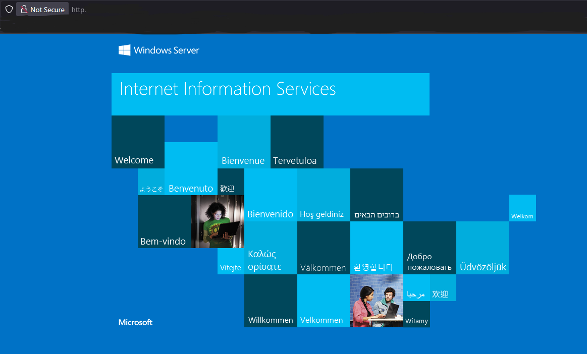

# Terraform-Azure-IIS-Webserver (Sanitized version of course)
Provisioned an end-to-end Azure IaaS environment with Terraform, automating: 
 
- Networking (VNet, Subnets, NSG) 
- Compute (Windows web Server VM + Managed Disk) 
- Security (Key Vault) 
- Scripting (Custom Script Extension) 
 
Configured a storage-backed Custom Script Extension to bootstrap IIS, delivering a fully functional web server at deployment.

Engineered components: Networking · Security · Compute · Storage · Automation · Application
 
---
 

The deployment includes:

- Virtual Network (app-network) – Secure network backbone for application components

- Network Security Group (app-nsg) – Enforces traffic filtering and segmentation

- Key Vault (key-vaultXXXXX) – Centralized storage of secrets and credentials

- Storage Account (terrastorageXXXXX) – Persistent storage for application and logs

- Virtual Machine (webvm1) with attached Data Disk (datadisk01 / webvm1_disk1_xxxxx) – Compute resources for hosting services

- Network Interface (networkinterface01) and Public IP (webip01) – External access to the VM

- Network Watcher (NetworkWatcher_xxx) – Monitoring and diagnostics 

- Developed a containerized automation script hosted in an Azure Storage Account. When a Windows VM is deployed, the script automatically connects to the instance and installs/configures IIS, transforming it into a ready-to-use web server.

----
[Sanitized Terraform Code](sanitizedcode.txt) 
 
---
terraform plan -out main.tfplan
----

var.adminpassword
  (prompt suppressed)

data.azurerm_key_vault.key-vault: Read complete
  id=/subscriptions/<SUBSCRIPTION_ID>/resourceGroups/<RG_NAME>/providers/Microsoft.KeyVault/vaults/<KEY_VAULT_NAME>

Plan: 16 to add, 0 to change, 0 to destroy.

+ azurerm_resource_group.appgrp
  name = "<RG_NAME>"
  location = "<REGION>"

+ azurerm_virtual_network.app_network
  name = "<VNET_NAME>"
  address_space = ["<VNET_CIDR>"]

+ azurerm_subnet.app_network_subnets["websubnet1"]
  address_prefixes = ["<SUBNET1_CIDR>"]

+ azurerm_subnet.app_network_subnets["appsubnet2"]
  address_prefixes = ["<SUBNET2_CIDR>"]

+ azurerm_network_security_group.app_nsg
  name = "<NSG_NAME>"
  rules:
    - Allow-3389  Inbound  TCP  3389  source="*"  priority=100
    - Allow-80    Inbound  TCP  80    source="*"  priority=200

+ azurerm_public_ip.webip
  name = "<PUBLIC_IP_NAME>"
  sku  = "Standard"

+ azurerm_network_interface.network_interfaces
  name = "<NIC_NAME>"
  ip_configuration:
    - name = "internal"
      subnet_id = <SUBNET_ID>

+ azurerm_windows_virtual_machine.vms
  name           = "<VM_NAME>"
  size           = "Standard_B2s"
  admin_username = "<ADMIN_USER>"
  admin_password = (sensitive)

+ azurerm_key_vault_secret.vmpassword
  name = "<SECRET_NAME>"
  value = (sensitive)

+ azurerm_storage_account.terrastorage
  name = "<STORAGE_ACCOUNT_NAME>"
  public_network_access_enabled = true
  allow_nested_items_to_be_public = true
  local_user_enabled = true
  shared_access_key_enabled = true

+ azurerm_storage_container.scripts
  name = "scripts"
  container_access_type = "blob"   # anonymous read

+ azurerm_storage_blob.IISConfig
  name = "IIS.ps1"
  storage_account_name = "<STORAGE_ACCOUNT_NAME>"
  storage_container_name = "scripts"

+ azurerm_virtual_machine_extension.vmextension
  type = "CustomScriptExtension"
  settings:
    fileUris = ["https://<STORAGE_ACCOUNT_NAME>.blob.core.windows.net/scripts/IIS.ps1"]
    commandToExecute = "powershell -ExecutionPolicy Unrestricted -file IIS.ps1"

+ azurerm_managed_disk.datadisk01
  name = "<DATA_DISK_NAME>"
  size_gb = 4  
  
-  
---
Azure Resources:

 
 
 
 

---

Cut costs the easy way: use (Terraform destroy) to destroy resources before they destroy your wallet. 
-  
